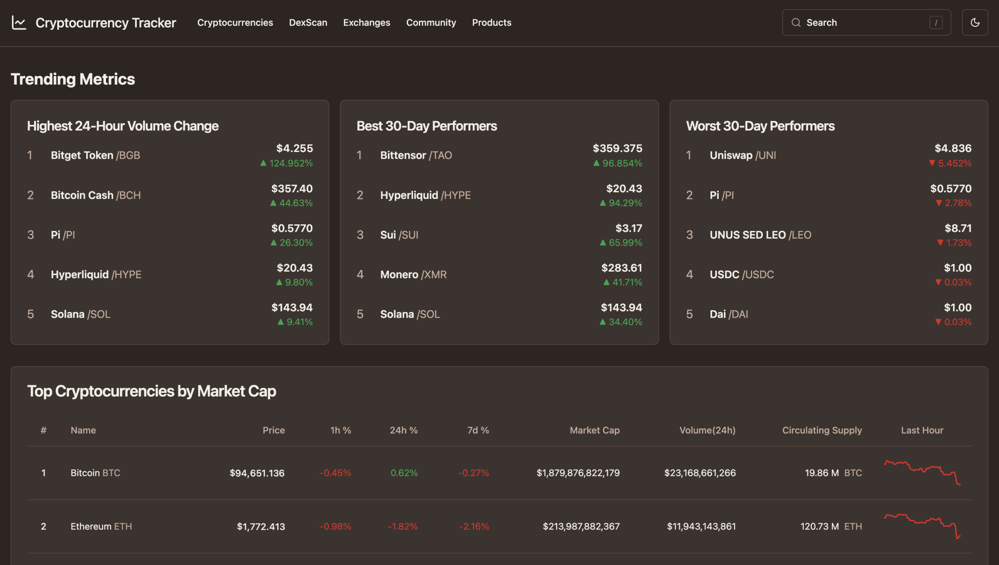

# Cryptocurrency Tracker

A modern cryptocurrency tracking dashboard built with **SvelteKit**, **Svelte 5**, **TypeScript**, **PostgreSQL**, **Tailwind v4**, and **shadcn‑svelte**.  
The application fetches near real‑time market data from the **CoinMarketCap API** and presents it using a clean, responsive UI inspired by CoinMarketCap’s design language.

This project was created as part of a **design course** at my school, focusing on modern UI/UX principles, data visualization, and frontend architecture.


## Features

- Real‑time cryptocurrency prices & market data  
- Individual coin detail pages with price history  
- Responsive UI using shadcn‑svelte components  
- Interactive charts powered by LayerChart/shadcn-svelte 
- PostgreSQL persistence layer  
- Fully typed with TypeScript  
- SvelteKit server endpoints for secure API routing  

## Preview

### Overview  


### Coin View  


## Getting Started

### 1. Install dependencies

```bash
npm install
```

### 2. Set up PostgreSQL

Start the local DB container:

```bash
npm run db:start
```

Push schema:

```bash
npm run db:push
```

### 3. Run in development mode

```bash
npm run dev
```

The app will launch at:

```
http://localhost:5173
```

## Building for Production

```bash
npm run build
```

The production server output will be located in:

```
build/
```

## Deploying

You can run the built app using **PM2**, **Nginx**, **Docker**, or any modern Node environment:

```bash
node build/index.js
```

For long‑running deployments, PM2 is recommended.
