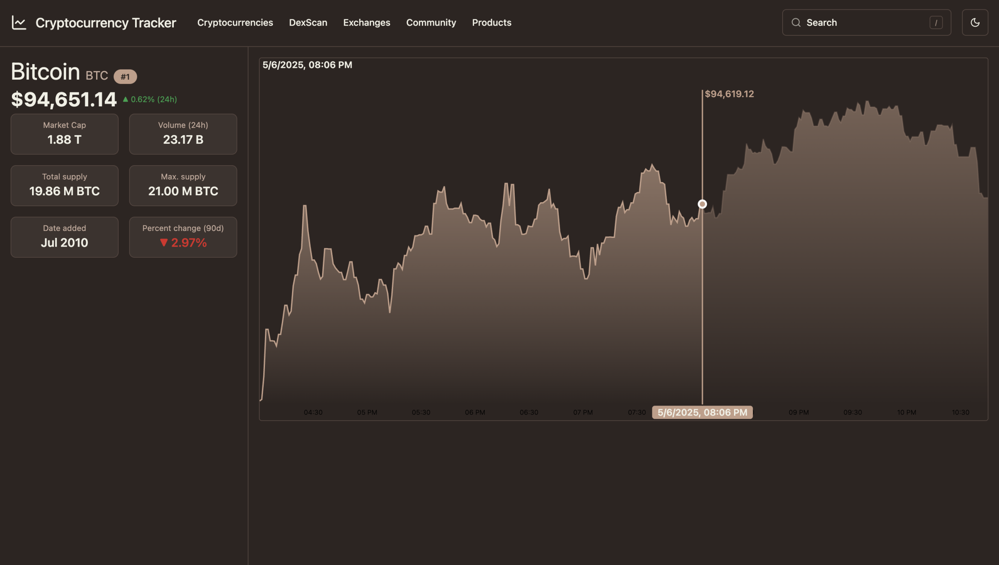

# Cryptocurrency Tracker

A cryptocurrency tracker built with SvelteKit, Svelte, TypeScript, PostgreSQL and Shadcn-svelte. It uses the CoinMarketCap API to fetch near real-time cryptocurrency data. The UI is similar to the official CoinMarketCap website.




## Setup

### Install dependencies
```bash
npm i
```

### Setup and configure PostgreSQL
```bash
npm run db:start
```

```bash
npm run db:push
```

### Run in dev mode
```bash
npm run dev
```

## Building

To create a production version of your app:

```bash
npm run build
```

## Run in production

After building you can run build/index.js using pm2, nginx or something simmilar.
